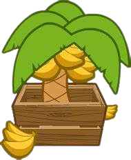

<h1 align="center">BananzaBTD6</h1>

Adds the bananza gamemode to BTD6. Gives you DOUBLE cash generation, more starting cash to jumpstart your farming early game, and sets the end round to round 200 instead of 100. Pair this with other mods to recreate the BTDB fun!

